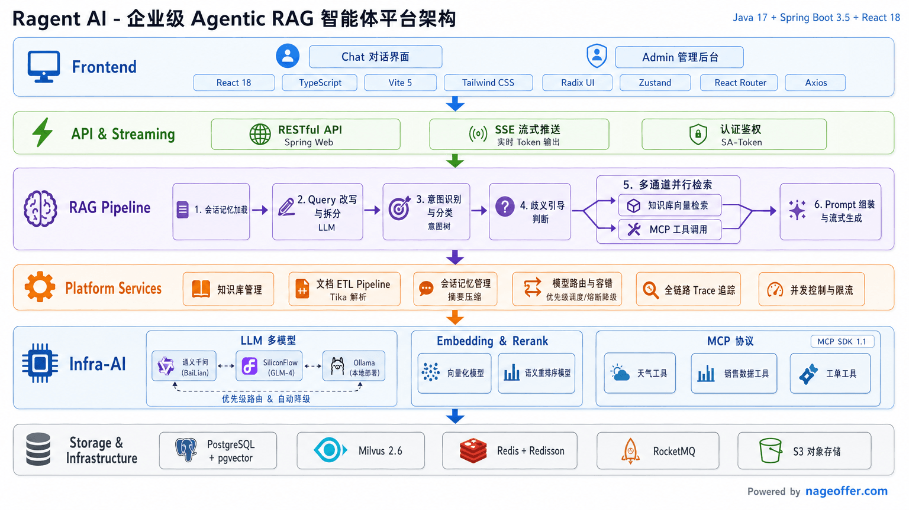
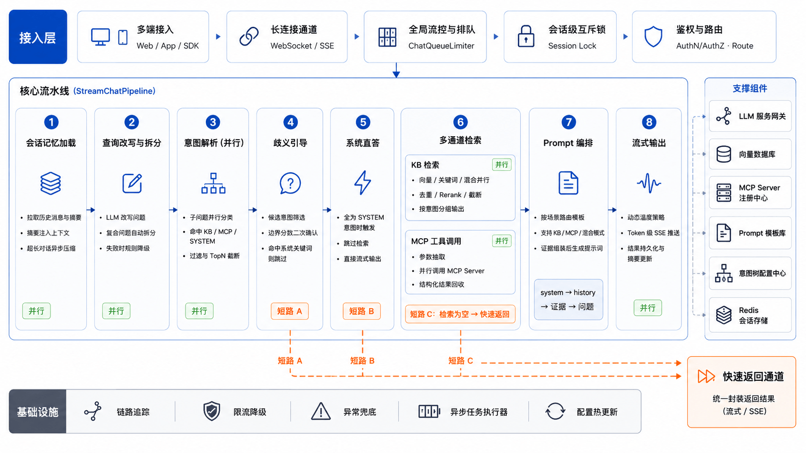
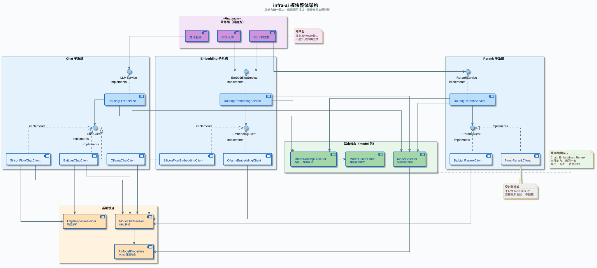
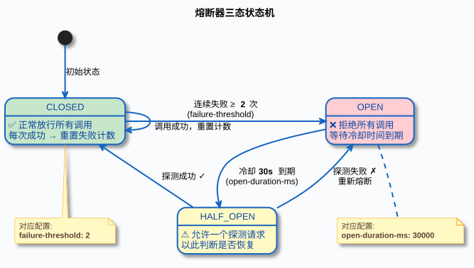

<p align="center">
  <a href="https://github.com/nageoffer/ragent">
    
  </a>
</p>

<p align="center">
  <strong>Ragent — 企业级 Agentic RAG 智能问答系统</strong>
</p>

<p align="center">
  <a href="https://github.com/nageoffer/ragent/stargazers"></a>&nbsp;
  <a href="https://github.com/nageoffer/ragent/network/members"></a>&nbsp;
  <a href="https://github.com/nageoffer/ragent/graphs/contributors"></a>&nbsp;
  <a href="./LICENSE"></a>&nbsp;
  &nbsp;
  
</p>

## 项目简介

Ragent 是一个基于 Spring Boot 3 + React 18 构建的 Agentic RAG（Retrieval-Augmented Generation）智能问答系统，覆盖从文档入库到智能问答的完整链路，提供多路检索、意图识别、查询重写、会话记忆、多模型路由容错、MCP 工具集成与可编排的文档入库 ETL 管道等能力。



### 核心功能

- **多路检索**：意图定向通道与向量全局通道并行检索，结果经去重、语义重排（Rerank）后处理链精炼，兼顾精准与召回。
- **意图识别**：树形多级意图体系（知识库 / 系统 / MCP 三类），LLM 低温度分类，置信度不足时主动引导用户澄清，支持按节点配置模型、提示词、topK 等参数。
- **查询重写**：术语归一化（数据库映射表 + Redis 缓存）+ LLM 改写与多子问题拆分，结合最近对话历史完成指代消解。
- **会话记忆**：滑动窗口保留近期轮次，超出阈值由 LLM 自动压缩为摘要，控制 Token 成本。
- **模型路由与容错**：多供应商候选清单按优先级调度，三态熔断器（CLOSED → OPEN → HALF_OPEN）隔离故障模型，流式首包探测实现切换时用户无感知。
- **MCP 集成**：非知识类意图自动提取参数并调用业务工具（JSON-RPC 2.0），检索结果与工具结果可混合生成回答。
- **文档入库 ETL**：基于节点编排的 Pipeline（Fetcher / Parser / Chunker / Enhancer / Enricher / Indexer），支持条件执行、增量刷新与节点级执行日志。
- **可观测性**：基于 AOP 注解的全链路 Trace，记录各环节耗时、输入输出与异常信息。
- **并发治理**：基于 Redis ZSET + Lua 脚本 + Pub/Sub 的分布式排队限流，排队状态通过 SSE 实时推送。

一次用户提问在服务端经过的核心链路：



## 技术栈

| 类别 | 技术 |
|:---|:---|
| 后端 | Java 17、Spring Boot 3.5、MyBatis-Plus、Sa-Token、Redisson、RocketMQ、OkHttp |
| 数据存储 | PostgreSQL（含 pgvector 扩展，默认向量后端）、Milvus（可选向量后端）、Redis |
| 文件存储 | S3 兼容对象存储（开发环境使用 RustFS） |
| 文档解析 | Apache Tika、Markdown 解析 |
| 前端 | React 18、TypeScript、Vite、TailwindCSS、shadcn/ui（Radix）、Zustand、react-markdown、recharts |
| 基础设施 | Docker Compose、Maven 多模块、Spotless（Apache 2.0 License 头自动校验） |

> 模型接入层为自研实现（非 Spring AI / LangChain4j），通过统一的 `ChatClient` / `EmbeddingClient` / `RerankClient` 接口对接 Ollama、阿里云百炼、SiliconFlow 及 OpenAI 兼容代理等多家供应商。

## 模块架构

后端采用 Maven 多模块分层：`framework` 提供与业务无关的通用能力，`infra-ai` 屏蔽不同模型供应商的差异，`bootstrap` 专注业务逻辑——更换模型供应商无需改动业务代码，调整业务逻辑无需触碰基础设施。


| 模块 | 职责 | 端口 |
|:---|:---|:---|
| `framework` | 公共基础框架：三级异常体系、分布式 ID（Snowflake）、幂等、缓存、RocketMQ 封装、链路追踪、SSE 封装、用户上下文跨线程透传 | — |
| `infra-ai` | AI 基础设施：多供应商 Chat / Embedding / Rerank 客户端、优先级路由、三态熔断、流式首包探测 | — |
| `bootstrap` | 主业务应用：RAG 对话管线、知识库管理、文档入库 ETL、用户认证、管理后台接口 | 9090（context-path `/api/ragent`） |
| `mcp-server` | 独立 MCP 工具服务器，JSON-RPC 2.0 over HTTP | 9099 |

前端为独立的 Vite 工程（`frontend/`），开发服务器端口 5173，`/api` 自动代理至后端 9090。

### 关键设计

<details>
<summary><b>多路检索、模型路由与入库管道</b>（点击展开）</summary>

检索引擎采用多通道并行 + 后处理流水线架构，每个通道独立执行、互不影响，由线程池并行调度；后处理器按 `getOrder()` 顺序串联，逐步精炼检索结果：


模型路由解决多供应商调度与故障转移问题：



每个模型独立维护三态熔断器，失败次数达到阈值自动熔断，冷却期后半开放行探测请求：



文档从上传到可检索，经过一条基于节点编排的 Pipeline，每个节点的配置存储在数据库中，支持条件执行与输出链式传递，每个任务和节点都有独立的执行日志：


</details>

## 快速开始

### 环境要求

- JDK 17+
- Node.js 18+（前端开发）
- Docker 与 Docker Compose（基础设施）
- Maven（仓库内置 `mvnw` wrapper，无需单独安装）

### 1. 启动基础设施

```bash
# 开发环境一体化栈（PostgreSQL + Redis + RocketMQ + RustFS + Milvus）
docker compose -f resources/docker/dev-all-in-one.compose.yaml up -d
```

低配机器可使用 `resources/docker/lightweight/` 下的轻量栈，或按需单独启动 `milvus-stack-*.compose.yaml` / `rocketmq-stack-*.compose.yaml`。

### 2. 初始化数据库

按顺序执行 `resources/database/` 下的脚本（数据库为 PostgreSQL）：

```bash
# 1. 建表
psql -f resources/database/schema_pg.sql
# 2. 初始数据
psql -f resources/database/init_data_pg.sql
# 3. 如从旧版本升级，按版本顺序执行 upgrade_v*.sql
```

### 3. 配置模型供应商

主配置文件为 `bootstrap/src/main/resources/application.yaml`，模型 API Key 通过环境变量注入：

| 环境变量 | 供应商 |
|:---|:---|
| `BAILIAN_API_KEY` | 阿里云百炼（Chat + Rerank） |
| `SILICONFLOW_API_KEY` | SiliconFlow（Chat + Embedding） |
| `NEWAPI_API_KEY` | NewAPI（OpenAI 兼容代理，Chat） |

本地 Ollama 无需 Key。其余关键配置项：

- `rag.vector.type`：切换向量后端（`pg` 默认 / `milvus`）
- `ai.chat.candidates` / `ai.chat.default-model`：多模型候选清单与首选模型
- `ai.selection.failure-threshold` / `open-duration-ms`：熔断阈值与冷却窗口
- `rag.memory.*`：会话记忆窗口与摘要触发
- `rag.rate-limit.global`：全局并发限流开关

### 4. 启动后端

```bash
# 构建（Spotless 在 compile 阶段自动格式化并补全 License 头）
./mvnw clean package -DskipTests

# 启动主应用（端口 9090）
./mvnw spring-boot:run -pl bootstrap

# 启动 MCP Server（端口 9099，独立进程，可选）
./mvnw spring-boot:run -pl mcp-server
```

### 5. 启动前端

```bash
cd frontend
npm install
npm run dev    # http://localhost:5173，/api 自动代理至后端
```

其他前端命令：`npm run build`（生产构建）、`npm run lint`（ESLint，任何 warning 视为失败）、`npm run format`（Prettier）。

## 目录结构

```
ragent
├── framework/         # 公共基础框架（异常、分布式 ID、幂等、MQ、Trace、SSE 等横切能力）
├── infra-ai/          # AI 基础设施（多供应商客户端 + 路由 + 熔断）
├── bootstrap/         # 主业务应用
│   └── src/main/java/com/nageoffer/ai/ragent/
│       ├── rag/       # RAG 对话核心（intent / retrieve / rewrite / memory / vector / mcp ...）
│       ├── knowledge/ # 知识库、文档、分块管理 + S3 文件存储
│       ├── ingestion/ # 文档入库 ETL 管道
│       ├── core/      # 通用文档解析与分块策略
│       ├── admin/     # 管理后台仪表盘
│       └── user/      # Sa-Token 用户认证
├── mcp-server/        # 独立 MCP 工具服务器（JSON-RPC 2.0）
├── frontend/          # React 18 + Vite 前端工程
├── resources/
│   ├── docker/        # Docker Compose 编排文件
│   └── database/      # PostgreSQL schema 与初始化/升级脚本
└── docs/              # 架构与使用文档
```

## 界面预览

### 问答界面

支持自然语言输入、深度思考模式、Markdown 渲染、代码高亮与回答评价：


### 管理后台

提供仪表盘、知识库管理、意图树编辑、入库监控、链路追踪、模型与系统设置等功能：

<details>
<summary><b>管理后台界面截图</b>（点击展开）</summary>


</details>

## 参考文档

- [快速开始](docs/quick-start.md) — 启动流程与最小配置
- [多路检索引擎](docs/multi-channel-retrieval.md) — 检索架构与扩展指南
- [PDF 入库示例](docs/examples/pdf-ingestion-example.md) — PDF 入库 Pipeline 示例
- [前端测试约定](frontend/TESTING.md)

## 扩展点

核心模块均面向接口设计，新增扩展只需实现接口并注册为 Spring Bean：

| 扩展场景 | 接口 |
|:---|:---|
| 新增检索通道 | `SearchChannel` |
| 新增检索后处理器 | `SearchResultPostProcessor` |
| 新增 MCP 工具 | `MCPToolExecutor` |
| 新增入库节点 | `IngestionNode` |
| 新增模型供应商 | `ChatClient` / `EmbeddingClient` / `RerankClient` + `ModelProvider` 枚举 + 候选列表配置 |

## 贡献

欢迎通过 Issue 与 Pull Request 参与共建。感谢所有贡献者：

<p align="left">
    <a href="https://github.com/nageoffer/ragent/graphs/contributors">
        
    </a>
</p>

## 许可证

本项目基于 [Apache License 2.0](./LICENSE) 开源。
